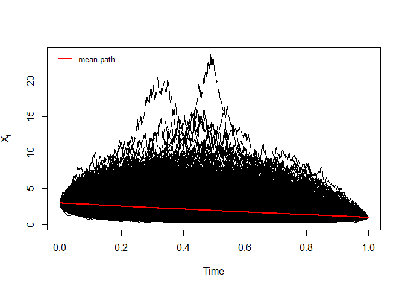
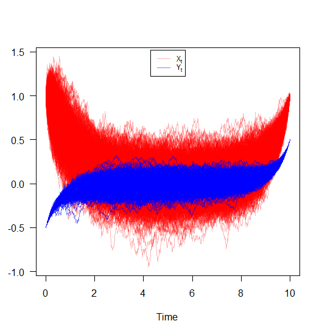
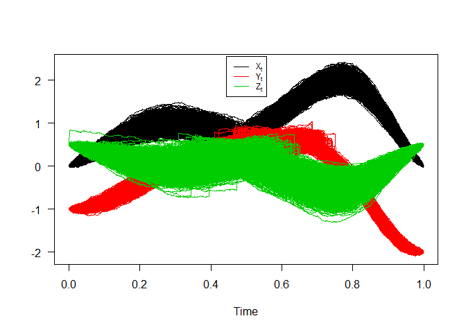
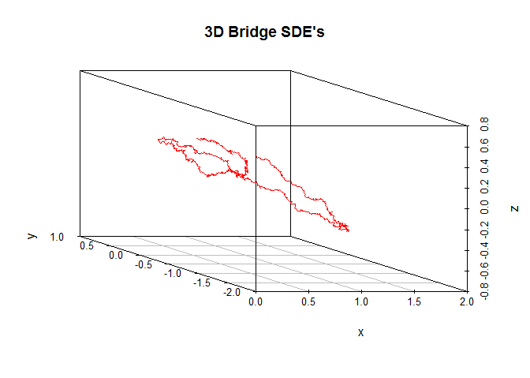

```{r setup, echo = F, message = F, results = 'hide'}
library(Sim.DiffProc)
library(knitr)
knitr::opts_chunk$set(comment="",prompt=TRUE, fig.show='hold', warning=FALSE, message=FALSE)
options(prompt="R> ",scipen=16,digits=5,warning=FALSE, message=FALSE,
        width = 70)
```

# Bridges SDE's

Consider now a $d$-dimensional stochastic process $X_{t}$ defined on a probability space $(\Omega, \mathfrak{F},\mathbb{P})$. We say that the bridge associated to $X_{t}$ conditioned to the event $\{X_{T}= a\}$ is the process:
$$
\{\tilde{X}_{t}, t_{0} \leq t \leq T \}=\{X_{t}, t_{0} \leq t \leq T: X_{T}= a \}
$$
where $T$ is a deterministic fixed time and $a \in \mathbb{R}^d$ is fixed too.

# The `bridgesdekd()` functions

The (S3) generic function `bridgesdekd()` (where `k=1,2,3`) for simulation of 1,2 and 3-dim bridge stochastic differential equations,Itô or Stratonovich type, with different methods. The main arguments consist: 


- The `drift` and `diffusion` coefficients as R expressions that depend on the state variable `x` (`y` and `z`) and time variable `t`.
- The number of simulation steps `N`.
- The number of the solution trajectories to be simulated by `M` (default: `M=1`).
- Initial value `x0` at initial time `t0`.
- Terminal value `y` final time `T`
- The integration step size `Dt` (default: `Dt=(T-t0)/N`).
- The choice of process types by the argument `type="ito"` for Ito or `type="str"` for Stratonovich (by default `type="ito"`).
- The numerical method to be used by `method` (default `method="euler"`).

By Monte-Carlo simulations, the following statistical measures (`S3 method`) for class `bridgesdekd()` (where `k=1,2,3`) can be approximated for the process at any time $t \in [t_{0},T]$ (default: `at=(T-t0)/2`):

* The expected value $\text{E}(X_{t})$ at time $t$, using the command `mean`.
* The variance $\text{Var}(X_{t})$ at time $t$, using the command `moment` with `order=2` and `center=TRUE`.
* The median $\text{Med}(X_{t})$ at time $t$, using the command `Median`.
* The mode $\text{Mod}(X_{t})$ at time $t$, using the command `Mode`.
* The quartile of $X_{t}$ at time $t$, using the command `quantile`.
* The maximum and minimum of $X_{t}$ at time $t$, using the command  `min` and `max`.
* The skewness and the kurtosis of $X_{t}$ at time $t$, using the command `skewness` and `kurtosis`.
* The coefficient of variation (relative variability) of $X_{t}$ at time $t$, using the command `cv`.
* The central moments up to order $p$ of $X_{t}$ at time $t$, using the command `moment`.
* The result summaries of the results of Monte-Carlo simulation at time $t$, using the command `summary`.

We can just make use of the `rsdekd()` function (where `k=1,2,3`) to build our random number for class `bridgesdekd()` (where `k=1,2,3`) at any time $t \in [t_{0},T]$. the main arguments consist:

- `object` an object inheriting from class `bridgesdekd()` (where `k=1,2,3`).
- `at` time between $s=t0$ and $t=T$.

The function `dsde()` (where `k=1,2,3`) approximate transition density for class `bridgesdekd()` (where `k=1,2,3`), the main arguments consist: 

- `object` an object inheriting from class `bridgesdekd()` (where `k=1,2,3`).
- `at` time between $s=t0$ and $t=T$.
- `pdf` probability density function `Joint` or `Marginal`.

The following we explain how to use this functions.

# `bridgesde1d()`

Assume that we want to describe the following bridge sde in Itô form:
\begin{equation}\label{eq0166}
dX_t = \frac{1-X_t}{1-t} dt + X_t dW_{t},\quad X_{t_{0}}=3 \quad\text{and}\quad X_{T}=1
\end{equation}
We simulate a flow of $5000$ trajectories, with integration step size $\Delta t = 0.001$, and $x_0 = 3$ at time $t_0 = 0$, $y = 1$ at terminal time $T=1$.

```{r}
f <- expression((1-x)/(1-t))
g <- expression(x)
mod <- bridgesde1d(drift=f,diffusion=g,x0=3,y=1,M=5000,method="milstein")
mod
summary(mod) ## default: summary at time = (T-t0)/2
```
In Figure 1, we present the flow of trajectories, the mean path (red lines) of solution of $X_{t}|X_{0}=3,X_{T}=1$:

```{r 01,fig.env='figure*', fig.cap=' ',eval=FALSE, include=TRUE}
plot(mod,ylab=expression(X[t]))
lines(time(mod),apply(mod$X,1,mean),col=2,lwd=2)
legend("topleft","mean path",inset = .01,col=2,lwd=2,cex=0.8,bty="n")
```

```{r 33, echo=FALSE, fig.cap=' Bridge sde 1D ', fig.env='figure*',fig.width=7,fig.height=7}

```

Figure 2, show approximation results for $m(t)=\text{E}(X_{t}|X_{0}=3,X_{T}=1)$ and $S(t)=\text{V}(X_{t}|X_{0}=3,X_{T}=1)$:

```{r 02, fig.cap='  ', fig.env='figure*'}
m  <- apply(mod$X,1,mean) 
S  <- apply(mod$X,1,var)
out <- data.frame(m,S)
matplot(time(mod), out, type = "l", xlab = "time", ylab = "", col=2:3,lwd=2,lty=2:3,las=1)
legend("topright",c(expression(m(t),S(t))),col=2:3,lty=2:3,lwd=2,bty="n")
```

The following statistical measures (`S3 method`) for class `bridgesde1d()` can be approximated for the $X_{t}|X_{0}=3,X_{T}=1$ process at any time $t$, for example `at=0.55`:

```{r}
s = 0.55
mean(mod, at = s)
moment(mod, at = s , center = TRUE , order = 2) ## variance
Median(mod, at = s)
Mode(mod, at = s)
quantile(mod , at = s)
kurtosis(mod , at = s)
skewness(mod , at = s)
cv(mod , at = s )
min(mod , at = s)
max(mod , at = s)
moment(mod, at = s , center= TRUE , order = 4)
moment(mod, at = s , center= FALSE , order = 4)
```

The result summaries of the $X_{t}|X_{0}=3,X_{T}=1$ process at time $t=0.55$:

```{r}
summary(mod, at = 0.55)
```

Hence we can just make use of the `rsde1d()` function to build our random number generator for $X_{t}|X_{0}=3,X_{T}=1$ at time $t=0.55$: 

```{r}
x <- rsde1d(object = mod, at = s) 
head(x, n = 10)
summary(x)
```
Display the random number generator for $X_{t}|X_{0}=3,X_{T}=1$, see Figure 3:

```{r 03 ,fig.env='figure*', fig.cap='  '}
plot(time(mod),mod$X[,1],type="l",ylab="X(t)",xlab="time",axes=F,lty=3)
points(s,x[1],pch=19,col=2,cex=0.5)
lines(c(s,s),c(0,x[1]),lty=2,col=2)
lines(c(0,s),c(x[1],x[1]),lty=2,col=2)
axis(1, s, bquote(at==.(s)),col=2,col.ticks=2)
axis(2, x[1], bquote(X[t==.(s)]),col=2,col.ticks=2)
legend('topright',col=2,pch=19,legend=bquote(X[t==.(s)]==.(x[1])),bty = 'n')
box()
```
The function `dsde1d()` can be used to show the kernel density estimation for $X_{t}|X_{0}=3,X_{T}=1$ at time $t=0.55$ (`hist=TRUE` based on `truehist()` function in [MASS](https://cran.r-project.org/package=MASS) package):

```{r 04,fig.env='figure*', fig.cap='  '}
dens <- dsde1d(mod, at = s)
dens
plot(dens,hist=TRUE) ## histgramme
plot(dens,add=TRUE)  ## kernel density
```

Approximate the transitional densitie of $X_{t}|X_{0}=3,X_{T}=1$ at $t-s = \{0.25,0.75\}$:

```{r 05,fig.env='figure*', fig.cap=' Transitional densitie at time $t-s = 0.25,0.75$ '}
plot(dsde1d(mod,at=0.75))
plot(dsde1d(mod,at=0.25),add=TRUE)
legend('topright',col=c('#0000FF4B','#FF00004B'),pch=15,legend=c("t-s=0.25","t-s=0.75"),bty = 'n')
```


[Return to bridgesde1d()](#bridgesde1d)

# `bridgesde2d()`

Assume that we want to describe the following $2$-dimensional bridge SDE's in Stratonovich form:

\begin{equation}\label{eq:09}
\begin{cases}
dX_t = -(1+Y_{t}) X_{t} dt +  0.2 (1-Y_{t})\circ dW_{1,t},\quad X_{t_{0}}=1 \quad\text{and}\quad X_{T}=1\\
dY_t = -(1+X_{t}) Y_{t} dt +  0.1 (1-X_{t}) \circ dW_{2,t},\quad Y_{t_{0}}=-0.5 \quad\text{and}\quad Y_{T}=0.5
\end{cases}
\end{equation}

We simulate a flow of $5000$ trajectories, with integration step size $\Delta t = 0.01$, and using Runge-Kutta method order 1:

```{r}
fx <- expression(-(1+y)*x , -(1+x)*y)
gx <- expression(0.2*(1-y),0.1*(1-x))
mod2 <- bridgesde2d(drift=fx,diffusion=gx,x0=c(1,-0.5),y=c(1,0.5),Dt=0.01,M=5000,type="str",method="rk1")
mod2
summary(mod2) ## default: summary at time = (T-t0)/2
```
In Figure 6, we present the flow of trajectories of $X_{t}|X_{0}=1,X_{T}=1$ and $Y_{t}|Y_{0}=-0.5,Y_{T}=0.5$:

```{r 06,fig.env='figure*', fig.cap=' ',eval=FALSE, include=TRUE}
plot(mod2,col=c('#FF00004B','#0000FF82'))
```
```{r 333, echo=FALSE, fig.cap='  Bridge sde 2D ', fig.env='figure*',fig.width=7,fig.height=7}

```

Figure 7, show approximation results for $m_{1}(t)=\text{E}(X_{t}|X_{0}=1,X_{T}=1)$, $m_{2}(t)=\text{E}(Y_{t}|Y_{0}=-0.5,Y_{T}=0.5)$,and  $S_{1}(t)=\text{V}(X_{t}|X_{0}=1,X_{T}=1)$, $S_{2}(t)=\text{V}(Y_{t}|Y_{0}=-0.5,Y_{T}=0.5)$, and $C_{12}(t)=\text{COV}(X_{t},Y_{t}|X_{0}=1,Y_{0}=-0.5,X_{T}=1,Y_{T}=0.5)$:

```{r 07, fig.cap='  ', fig.env='figure*'}
m1  <- apply(mod2$X,1,mean) 
m2  <- apply(mod2$Y,1,mean) 
S1  <- apply(mod2$X,1,var)
S2  <- apply(mod2$Y,1,var)
C12 <- sapply(1:dim(mod2$X)[1],function(i) cov(mod2$X[i,],mod2$Y[i,]))
out2 <- data.frame(m1,m2,S1,S2,C12)
matplot(time(mod2), out2, type = "l", xlab = "time", ylab = "", col=2:6,lwd=2,lty=2:6,las=1)
legend("top",c(expression(m[1](t),m[2](t),S[1](t),S[2](t),C[12](t))),col=2:6,lty=2:6,lwd=2,bty="n")
```

The following statistical measures (`S3 method`) for class `bridgesde2d()` can be approximated for the $X_{t}|X_{0}=1,X_{T}=1$ and $Y_{t}|Y_{0}=-0.5,Y_{T}=0.5$ process at any time $t$, for example `at=6.75`:

```{r}
s = 6.75
mean(mod2, at = s)
moment(mod2, at = s , center = TRUE , order = 2) ## variance
Median(mod2, at = s)
Mode(mod2, at = s)
quantile(mod2 , at = s)
kurtosis(mod2 , at = s)
skewness(mod2 , at = s)
cv(mod2 , at = s )
min(mod2 , at = s)
max(mod2 , at = s)
moment(mod2 , at = s , center= TRUE , order = 4)
moment(mod2 , at = s , center= FALSE , order = 4)
```
The result summaries of the $X_{t}|X_{0}=1,X_{T}=1$ and $Y_{t}|Y_{0}=-0.5,Y_{T}=0.5$ process at time $t=6.75$:
```{r}
summary(mod2, at = 6.75)
```
Hence we can just make use of the `rsde2d()` function to build our random number generator for the couple $X_{t},Y_{t}|X_{0}=1,Y_{0}=-0.5,X_{T}=1,Y_{T}=0.5$ at time $t=6.75$: 

```{r}
x2 <- rsde2d(object = mod2, at = s) 
head(x2, n = 10)
summary(x2)
```
Display the random number generator for the couple $X_{t},Y_{t}|X_{0}=1,Y_{0}=-0.5,X_{T}=1,Y_{T}=0.5$, see Figure 8:

```{r 08,fig.env='figure*', fig.cap=' '}
plot(ts.union(mod2$X[,1],mod2$Y[,1]),col=1:2,lty=3,plot.type="single",type="l",ylab= "",xlab="time",axes=F)
points(s,x2$x[1],pch=19,col=3,cex=0.8)
points(s,x2$y[1],pch=19,col=4,cex=0.8)
lines(c(s,s),c(-10,x2$x[1]),lty=2,col=6)
lines(c(0,s),c(x2$x[1],x2$x[1]),lty=2,col=3)
lines(c(0,s),c(x2$y[1],x2$y[1]),lty=2,col=4)
axis(1, s, bquote(at==.(s)),col=6,col.ticks=6)
axis(2, x2$x[1], bquote(X[t==.(s)]),col=3,col.ticks=3)
axis(2, x2$y[1], bquote(Y[t==.(s)]),col=4,col.ticks=4)
legend('topright',legend=bquote(c(X[t==.(s)]==.(x2$x[1]),Y[t==.(s)]==.(x2$y[1]))),bty = 'n')
box()
```
For each SDE type and for each numerical scheme, the density of $X_{t}|X_{0}=1,X_{T}=1$ and $Y_{t}|Y_{0}=-0.5,Y_{T}=0.5$ at time $t=6.75$ are reported using `dsde2d()` function, see e.g. Figure 9:

```{r 09,fig.env='figure*', fig.cap='  '}
denM <- dsde2d(mod2,pdf="M",at =s)
denM
plot(denM, main="Marginal Density")
```

Created using `dsde2d()` plotted in (x, y)-space with `dim = 2`. A `contour` and `image` plot of density obtained from a realization of the couple $X_{t},Y_{t}|X_{0}=1,Y_{0}=-0.5,X_{T}=1,Y_{T}=0.5$ at time `t=6.75`.

```{r 10,fig.env='figure*', fig.cap='  '}
denJ <- dsde2d(mod2, pdf="J", n=100,at =s)
denJ
plot(denJ,display="contour",main="Bivariate Transition Density at time t=6.755")
plot(denJ,display="image",main="Bivariate Transition Density at time t=6.755")
```

A $3$D plot of the transition density at $t=6.75$ obtained with: 

```{r 11,fig.env='figure*', fig.cap='  '}
plot(denJ,main="Bivariate Transition Density at time t=6.75")
```
We approximate the bivariate transition density over the set transition horizons $t\in [1,9]$ with $\Delta t = 0.005$ using the code:

```{r ,eval=FALSE, include=TRUE}
for (i in seq(1,9,by=0.005)){ 
plot(dsde2d(mod2, at = i,n=100),display="contour",main=paste0('Transition Density \n t = ',i))
}
```

[Return to bridgesde2d()](#bridgesde2d)

# `bridgesde3d()`

Assume that we want to describe the following bridges SDE's (3D) in Itô form:

\begin{equation}
\begin{cases}
dX_t = -4 (1+X_{t}) Y_{t} dt + 0.2 dW_{1,t},\quad X_{t_{0}}=0 \quad\text{and}\quad X_{T}=0\\
dY_t = 4 (1-Y_{t}) X_{t} dt + 0.2 dW_{2,t},\quad Y_{t_{0}}=-1 \quad\text{and}\quad Y_{T}=-2\\
dZ_t = 4 (1-Z_{t}) Y_{t} dt + 0.2 dW_{3,t},\quad Z_{t_{0}}=0.5 \quad\text{and}\quad Z_{T}=0.5
\end{cases}
\end{equation}

We simulate a flow of $5000$ trajectories, with integration step size $\Delta t = 0.001$.

```{r}
fx <- expression(-4*(1+x)*y, 4*(1-y)*x, 4*(1-z)*y)
gx <- rep(expression(0.2),3)
mod3 <- bridgesde3d(x0=c(0,-1,0.5),y=c(0,-2,0.5),drift=fx,diffusion=gx,M=5000)
mod3
summary(mod3) ## default: summary at time = (T-t0)/2
```

For plotting (back in time) using the command `plot`, and `plot3D` in space the results of the simulation are shown in Figure 12:

```{r 12,fig.env='figure*', fig.cap=' ',eval=FALSE, include=TRUE}
plot(mod3) ## in time
plot3D(mod3,display = "persp",main="3D Bridge SDE's") ## in space 
```

```{r 3333, echo=FALSE, fig.cap=' ', fig.env='figure*',fig.width=7,fig.height=7}

```

```{r 33333, echo=FALSE, fig.cap='  Bridge sde 3D ', fig.env='figure*',fig.width=7,fig.height=7}

```

Figure 13, show approximation results for $m_{1}(t)=\text{E}(X_{t}|X_{0}=0,X_{T}=0)$, $m_{2}(t)=\text{E}(Y_{t}|Y_{0}=-1,Y_{T}=-2)$, $m_{3}(t)=\text{E}(Z_{t}|Z_{0}=0.5,Z_{T}=0.5)$ and  $S_{1}(t)=\text{V}(X_{t}|X_{0}=0,X_{T}=0)$, $S_{2}(t)=\text{V}(Y_{t}|Y_{0}=-1,Y_{T}=-2)$, $S_{3}(t)=\text{V}(Z_{t}|Z_{0}=0.5,Z_{T}=0.5)$,


```{r 13, fig.cap='  ', fig.env='figure*'}
m1  <- apply(mod3$X,1,mean) 
m2  <- apply(mod3$Y,1,mean) 
m3  <- apply(mod3$Z,1,mean) 
S1  <- apply(mod3$X,1,var)
S2  <- apply(mod3$Y,1,var)
S3  <- apply(mod3$Z,1,var)
out3 <- data.frame(m1,m2,m3,S1,S2,S3)
matplot(time(mod3), out3, type = "l", xlab = "time", ylab = "", col=2:7,lwd=2,lty=2:7,las=1)
legend("bottom",c(expression(m[1](t),m[2](t),m[3](t),S[1](t),S[2](t),S[3](t))),col=2:7,lty=2:7,lwd=2,bty="n")
```

The following statistical measures (`S3 method`) for class `bridgesde3d()` can be approximated for the $X_{t}|X_{0}=0,X_{T}=0$, $Y_{t}|Y_{0}=-1,Y_{T}=-2$ and $Z_{t}|Z_{0}=0.5,Z_{T}=0.5$ process at any time $t$, for example `at=0.75`:

```{r}
s = 0.75
mean(mod3, at = s)
moment(mod3, at = s , center = TRUE , order = 2) ## variance
Median(mod3, at = s)
Mode(mod3, at = s)
quantile(mod3 , at = s)
kurtosis(mod3 , at = s)
skewness(mod3 , at = s)
cv(mod3 , at = s )
min(mod3 , at = s)
max(mod3 , at = s)
moment(mod3 , at = s , center= TRUE , order = 4)
moment(mod3 , at = s , center= FALSE , order = 4)
```
The result summaries of the $X_{t}|X_{0}=0,X_{T}=0$, $Y_{t}|Y_{0}=-1,Y_{T}=-2$ and $Z_{t}|Z_{0}=0.5,Z_{T}=0.5$ process at time $t=0.75$:
```{r}
summary(mod3, at = 0.75)
```
Hence we can just make use of the `rsde3d()` function to build our random number generator for the triplet $X_{t},Y_{t},Z_{t}|X_{0}=0,Y_{0}=-1,Z_{0}=0.5,X_{T}=0,Y_{T}=-2,Z_{T}=0.5$ at time $t=0.75$: 

```{r}
x3 <- rsde3d(object = mod3, at = s) 
head(x3, n = 10)
summary(x3)
```
Display the random number generator for triplet $X_{t},Y_{t},Z_{t}|X_{0}=0,Y_{0}=-1,Z_{0}=0.5,X_{T}=0,Y_{T}=-2,Z_{T}=0.5$ at time $t=0.75$: , see Figure 14:

```{r 14,fig.env='figure*', fig.cap=' '}
plot(ts.union(mod3$X[,1],mod3$Y[,1],mod3$Z[,1]),col=1:3,lty=3,plot.type="single",type="l",ylab= "",xlab="time",axes=F)
points(s,x3$x[1],pch=19,col=4,cex=0.8)
points(s,x3$y[1],pch=19,col=5,cex=0.8)
points(s,x3$z[1],pch=19,col=6,cex=0.8)
lines(c(s,s),c(-10,x3$x[1]),lty=2,col=7)
lines(c(0,s),c(x3$x[1],x3$x[1]),lty=2,col=4)
lines(c(0,s),c(x3$y[1],x3$y[1]),lty=2,col=5)
lines(c(0,s),c(x3$z[1],x3$z[1]),lty=2,col=6)
axis(1, s, bquote(at==.(s)),col=7,col.ticks=7)
axis(2, x3$x[1], bquote(X[t==.(s)]),col=4,col.ticks=4)
axis(2, x3$y[1], bquote(Y[t==.(s)]),col=5,col.ticks=5)
axis(2, x3$z[1], bquote(Z[t==.(s)]),col=6,col.ticks=6)
legend("bottomleft",legend=bquote(c(X[t==.(s)]==.(x3$x[1]),Y[t==.(s)]==.(x3$y[1]),Z[t==.(s)]==.(x3$z[1]))),bty = 'n',cex=0.75)
box()
```
For each SDE type and for each numerical scheme, the density of $X_{t}|X_{0}=0,X_{T}=0$, $Y_{t}|Y_{0}=-1,Y_{T}=-2$ and $Z_{t}|Z_{0}=0.5,Z_{T}=0.5$ process at time $t=0.75$ are reported using `dsde3d()` function, see e.g. Figure 15:

```{r 15,fig.env='figure*', fig.cap='  '}
denM <- dsde3d(mod3,pdf="M",at =s)
denM
plot(denM, main="Marginal Density")
```
For an approximate joint density for triplet $X_{t},Y_{t},Z_{t}|X_{0}=0,Y_{0}=-1,Z_{0}=0.5,X_{T}=0,Y_{T}=-2,Z_{T}=0.5$ at time $t=0.75$ (for more details, see package  [sm](https://cran.r-project.org/package=sm) or  [ks](https://cran.r-project.org/package=ks).)

```{r 111,fig.env='figure*', fig.cap='  ',eval=FALSE, include=TRUE}
denJ <- dsde3d(mod3,pdf="J",at=0.75)
plot(denJ,display="rgl")
```

[Return to bridgesde3d()](#bridgesde3d)

# Further reading

1. [`snssdekd()` & `dsdekd()` & `rsdekd()`- Monte-Carlo Simulation and Analysis of Stochastic Differential Equations](snssde.html).
2. [`bridgesdekd()` & `dsdekd()` & `rsdekd()` - Constructs and Analysis of Bridges Stochastic Differential Equations](bridgesde.html).
3. [`fptsdekd()` & `dfptsdekd()` - Monte-Carlo Simulation and Kernel Density Estimation of First passage time](fptsde.html).
4. [`MCM.sde()` & `MEM.sde()` - Parallel Monte-Carlo and Moment Equations for SDEs](mcmsde.html).
5. [`TEX.sde()` - Converting Sim.DiffProc Objects to LaTeX](sdetotex.html).
6. [`fitsde()` - Parametric Estimation of 1-D Stochastic Differential Equation](fitsde.html).


# References

1. Bladt, M. and Sorensen, M. (2007). Simple simulation of diffusion bridges with application to likelihood inference for diffusions. Working Paper, University of Copenhagen.

2. Guidoum AC, Boukhetala K (2018). Sim.DiffProc: Simulation of Diffusion Processes. R package version 4.1, URL https://cran.r-project.org/package=Sim.DiffProc.
